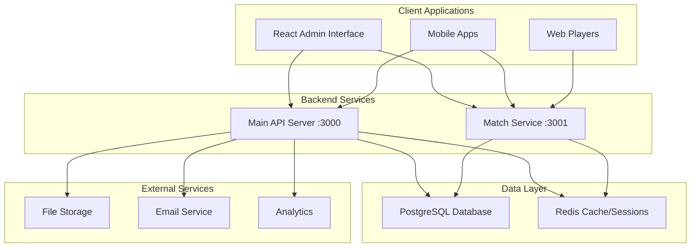

# Architecture Overview

## System Architecture

The QuizUP backend follows a **microservices architecture** with two main services:

1. **Main API Service** (Port 3000) - RESTful API for core functionality
2. **Match Service** (Port 3001) - WebSocket server for real-time gaming

### 🏗️ Service Architecture



### 🔧 Main API Service (Port 3000)

#### Core Responsibilities
- **User Management**: Authentication, authorization, profiles
- **Content Management**: Categories, quizzes, questions
- **Quiz Administration**: CRUD operations for quiz content
- **Analytics & Reporting**: Usage statistics and performance metrics
- **File Management**: Upload and storage of quiz assets

#### Technology Stack
- **Express.js**: Web framework for RESTful APIs
- **Sequelize ORM**: Database abstraction and migrations
- **JWT Authentication**: Stateless authentication with refresh tokens
- **Joi Validation**: Input validation and sanitization
- **Winston Logging**: Structured logging with multiple transports
- **Swagger/OpenAPI**: Comprehensive API documentation

#### API Structure
```
/api/
├── /auth              # Authentication endpoints
├── /users             # User management
├── /categories        # Category hierarchy
├── /quizzes           # Quiz CRUD operations
├── /questions         # Question bank management
├── /matches           # Match creation and management
├── /analytics         # Usage statistics
└── /admin             # Administrative functions
```

### ⚡ Match Service (Port 3001)

#### Core Responsibilities
- **Real-time Gaming**: WebSocket-based quiz gameplay
- **Match Management**: Live game state synchronization
- **Player Connections**: Managing concurrent player sessions
- **Scoring System**: Real-time score calculation and leaderboards
- **AI Opponents**: Automated player simulation

#### Technology Stack
- **Socket.io**: WebSocket server for real-time communication
- **Redis Adapter**: Scaling WebSocket connections across instances
- **Event-driven Architecture**: Asynchronous message handling
- **State Management**: In-memory and Redis-based state persistence
- **Load Balancing**: Sticky sessions for WebSocket connections

#### WebSocket Events
```typescript
// Client to Server Events
interface ClientEvents {
  authenticate: (data: AuthData) => void;
  join_match: (matchId: string) => void;
  submit_answer: (answer: AnswerData) => void;
  player_ready: () => void;
}

// Server to Client Events  
interface ServerEvents {
  match_joined: (data: MatchData) => void;
  question_started: (question: QuestionData) => void;
  answer_result: (result: ResultData) => void;
  match_completed: (results: FinalResults) => void;
}
```

### 🗄️ Database Design

#### PostgreSQL Schema
```sql
-- Core Tables
Users (id, email, username, password_hash, role, created_at)
Categories (id, name, description, parent_id, created_at)
Quizzes (id, title, description, category_id, difficulty, time_limit)
Questions (id, quiz_id, question_text, difficulty, created_by)
Options (id, question_id, option_text, is_correct)

-- Gaming Tables
Matches (id, quiz_id, status, created_by, max_players, created_at)
MatchPlayers (match_id, user_id, score, joined_at)
QuizAttempts (id, user_id, quiz_id, score, completed_at)
```

#### Key Indexes
```sql
-- Performance Indexes
CREATE INDEX idx_quizzes_category ON quizzes(category_id);
CREATE INDEX idx_questions_quiz ON questions(quiz_id);
CREATE INDEX idx_options_question ON options(question_id);
CREATE INDEX idx_matches_status ON matches(status);
CREATE INDEX idx_attempts_user_quiz ON quiz_attempts(user_id, quiz_id);
```

### 🔄 Redis Caching Strategy

#### Cache Patterns
```typescript
// Frequently Accessed Data
interface CacheKeys {
  user_session: `session:${userId}`;
  quiz_data: `quiz:${quizId}`;
  match_state: `match:${matchId}`;
  leaderboard: `leaderboard:${quizId}`;
  category_tree: 'categories:tree';
}

// Cache TTL Configuration
const CACHE_TTL = {
  sessions: 86400,      // 24 hours
  quiz_data: 3600,      // 1 hour  
  match_state: 7200,    // 2 hours
  leaderboards: 300,    // 5 minutes
  category_tree: 1800   // 30 minutes
};
```

### 🛡️ Security Implementation

#### Authentication Flow
```typescript
// JWT Token Structure
interface JWTPayload {
  userId: number;
  email: string;
  role: 'admin' | 'faculty' | 'student';
  iat: number;
  exp: number;
}

// Refresh Token Rotation
interface RefreshTokenFlow {
  login: () => { accessToken, refreshToken };
  refresh: (token) => { newAccessToken, newRefreshToken };
  logout: (token) => void; // Invalidate tokens
}
```

#### Authorization Middleware
```typescript
// Role-based Access Control
const authorize = (roles: Role[]) => {
  return (req: Request, res: Response, next: NextFunction) => {
    if (!req.user || !roles.includes(req.user.role)) {
      return res.status(403).json({ error: 'Insufficient permissions' });
    }
    next();
  };
};
```

### 📊 Performance Optimizations

#### Database Optimization
- **Connection Pooling**: Configurable pool size based on load
- **Query Optimization**: Eager loading with proper includes
- **Pagination**: Offset-based pagination for large datasets
- **Indexing Strategy**: Composite indexes for complex queries

#### Caching Strategy
- **Redis Clustering**: High availability and horizontal scaling
- **Cache Warming**: Preload frequently accessed data
- **Cache Invalidation**: Event-based cache updates
- **Memory Management**: LRU eviction policies

#### API Performance
- **Response Compression**: Gzip compression for large payloads
- **Rate Limiting**: Configurable limits per endpoint and user
- **Request Optimization**: Batch operations where applicable
- **Monitoring**: Performance metrics and alerting

### 🔍 Monitoring & Observability

#### Logging Strategy
```typescript
// Structured Logging Format
interface LogEntry {
  timestamp: string;
  level: 'debug' | 'info' | 'warn' | 'error' | 'critical';
  message: string;
  service: 'api' | 'match';
  requestId?: string;
  userId?: number;
  metadata?: Record<string, any>;
}
```

#### Health Check Endpoints
```typescript
// Service Health Monitoring
GET /health          // Basic health status
GET /health/detailed // Comprehensive system status
GET /metrics         // Prometheus-compatible metrics
```

### 🚀 Deployment Configuration

#### Docker Configuration
```dockerfile
# Multi-stage build
FROM node:18-alpine AS builder
WORKDIR /app
COPY package*.json ./
RUN npm ci --only=production

FROM node:18-alpine AS runtime  
WORKDIR /app
COPY --from=builder /app/node_modules ./node_modules
COPY . .
EXPOSE 3000
CMD ["npm", "start"]
```

#### Environment Configuration
```typescript
// Environment Variables
interface Config {
  NODE_ENV: 'development' | 'staging' | 'production';
  PORT: number;
  DB_HOST: string;
  DB_NAME: string;
  REDIS_URL: string;
  JWT_SECRET: string;
  LOG_LEVEL: LogLevel;
}
```

This architecture ensures scalability, maintainability, and high performance for the QuizUP platform while providing clear separation of concerns and robust error handling.
