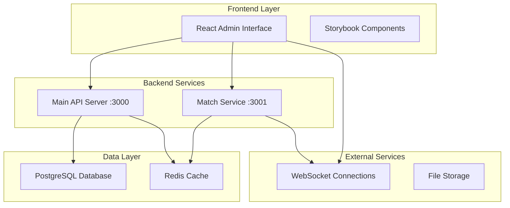

# Architecture Overview

## System Architecture

The QuizUP platform follows a **microservices architecture** with clear separation of concerns between the frontend admin interface and backend services.

### 🏗️ High-Level Architecture



### 📱 Frontend Architecture (React Admin)

- **Framework**: React 19 with TypeScript
- **Build Tool**: Vite for fast development and building
- **UI Library**: Radix UI components with Tailwind CSS
- **State Management**: React Context + Custom hooks
- **Routing**: React Router for navigation
- **Forms**: React Hook Form for form management
- **Real-time**: Socket.io client for WebSocket connections

#### Component Structure
```
src/
├── components/
│   ├── ui/              # Reusable UI components
│   ├── forms/           # Form components
│   ├── layout/          # Layout components
│   └── pages/           # Page-specific components
├── services/            # API service layers
├── hooks/               # Custom React hooks  
├── utils/               # Utility functions
└── types/               # TypeScript definitions
```

### ⚙️ Backend Architecture (Node.js API)

- **Framework**: Express.js with TypeScript
- **Database**: PostgreSQL with Sequelize ORM
- **Caching**: Redis for session management and performance
- **Authentication**: JWT with refresh token support
- **Real-time**: Socket.io server for live features
- **Validation**: Joi for request/response validation
- **Documentation**: Swagger/OpenAPI for API docs

#### Service Structure
```
src/
├── controllers/         # HTTP request handlers
├── services/           # Business logic layer
├── models/             # Database models (Sequelize)
├── routes/             # API route definitions
├── middleware/         # Express middleware
├── utils/              # Utility functions
└── types/              # TypeScript definitions
```

### 🔄 Data Flow

#### Quiz Management Flow
1. **Admin Creates Quiz** → Frontend form submission
2. **API Validation** → Backend validates and stores in PostgreSQL
3. **Cache Update** → Redis cache updated for performance
4. **Real-time Update** → WebSocket notifies connected clients

#### Live Match Flow
1. **Match Creation** → Main API creates match record
2. **Match Service** → Dedicated service handles real-time gameplay
3. **Player Connections** → WebSocket connections managed by Match Service
4. **State Synchronization** → Redis ensures consistent state across services

### 🛡️ Security Architecture

#### Authentication & Authorization
- **JWT Tokens**: Stateless authentication with refresh tokens
- **Role-based Access**: Admin, Faculty, Student roles with different permissions
- **Session Management**: Redis-based session storage
- **Password Security**: bcrypt hashing with salt rounds

#### API Security
- **Input Validation**: Joi schemas for all endpoints
- **Rate Limiting**: Express rate limiter middleware
- **CORS Protection**: Configured for specific origins
- **Security Headers**: Helmet middleware for security headers

### 📊 Database Design

#### Core Entities
- **Users**: Authentication and profile information
- **Categories**: Hierarchical quiz categories
- **Quizzes**: Quiz metadata and configuration
- **Questions**: Question bank with options and answers
- **Matches**: Real-time quiz game sessions
- **Results**: Quiz attempt results and analytics

#### Key Relationships
```sql
Users 1:N Quizzes (created by)
Categories 1:N Quizzes (belongs to)  
Quizzes 1:N Questions (contains)
Questions 1:N Options (has multiple)
Users N:M Matches (participates in)
Matches 1:N Results (generates)
```

### 🚀 Deployment Architecture

#### Development Environment
- **Frontend**: Vite dev server (localhost:5173)
- **Backend**: Express server (localhost:3000)
- **Match Service**: WebSocket server (localhost:3001)
- **Database**: Local PostgreSQL instance
- **Cache**: Local Redis instance

#### Production Environment
- **Frontend**: Static files served by CDN/nginx
- **Backend**: Load-balanced Express instances
- **Database**: PostgreSQL cluster with read replicas
- **Cache**: Redis cluster for high availability
- **WebSocket**: Socket.io with Redis adapter for scaling

### 🔧 Technology Stack

| Layer | Technology | Purpose |
|-------|------------|---------|
| Frontend | React 19 + TypeScript | Modern UI development |
| Build Tool | Vite | Fast development and building |
| UI Framework | Radix UI + Tailwind | Accessible components and styling |
| Backend | Node.js + Express | Server-side API development |
| Database | PostgreSQL + Sequelize | Relational data storage |
| Cache | Redis | Performance and session management |
| Real-time | Socket.io | WebSocket communication |
| Documentation | TypeDoc + Docusaurus | API and component documentation |

### 📈 Performance Considerations

#### Frontend Optimization
- **Code Splitting**: Route-based lazy loading
- **Bundle Optimization**: Tree shaking and minification
- **Caching Strategy**: Service worker for static assets
- **Performance Monitoring**: Core Web Vitals tracking

#### Backend Optimization  
- **Database Indexing**: Optimized queries with proper indexes
- **Connection Pooling**: Efficient database connection management
- **Caching Layer**: Redis for frequently accessed data
- **Response Compression**: Gzip compression for API responses

### 🔍 Monitoring & Observability

#### Logging Strategy
- **Structured Logs**: JSON format with consistent fields
- **Log Levels**: Debug, Info, Warn, Error, Critical
- **Context Tracking**: Request IDs and user context
- **Centralized Logging**: Winston with multiple transports

#### Metrics Collection
- **Application Metrics**: Custom business metrics
- **System Metrics**: CPU, memory, disk usage
- **Database Metrics**: Query performance and connection stats
- **WebSocket Metrics**: Connection counts and message rates

This architecture provides a scalable, maintainable, and secure foundation for the QuizUP platform with clear separation of concerns and modern development practices.
