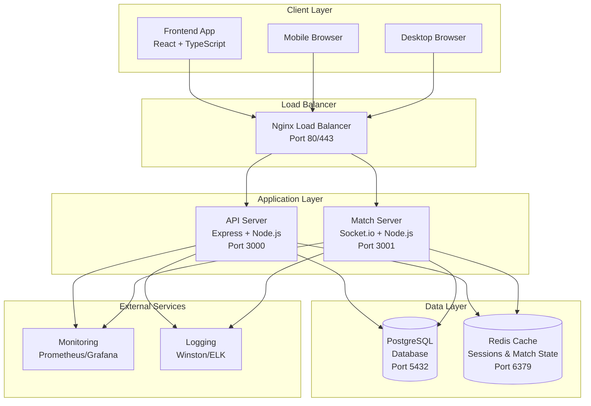

# QuizUP Architecture Diagrams

## Component Architecture Diagram



## Database Entity Relationship Diagram

```
┌─────────────────┐    ┌─────────────────┐    ┌─────────────────┐
│     Users       │    │   Categories    │    │     Quizzes     │
├─────────────────┤    ├─────────────────┤    ├─────────────────┤
│ id (PK)         │    │ id (PK)         │    │ id (PK)         │
│ username        │    │ name            │    │ title           │
│ email           │    │ parent_id (FK)  │────│ category_id (FK)│
│ password_hash   │    │ description     │    │ description     │
│ role            │    │ level           │    │ difficulty      │
│ first_name      │    │ path            │    │ time_limit      │
│ last_name       │    │ is_active       │    │ is_published    │
│ elo_rating      │    │ created_at      │    │ created_by_id   │
│ total_matches   │    └─────────────────┘    │ created_at      │
│ wins            │                           └─────────────────┘
│ losses          │           │                       │
│ created_at      │           │                       │
└─────────────────┘           │                       │
         │                    │                       │
         │                    │                       │
┌─────────────────┐    ┌─────────────────┐    ┌─────────────────┐
│ Question_Bank   │    │ Quiz_Questions  │    │ Quiz_Attempts   │
│     Items       │    ├─────────────────┤    ├─────────────────┤
├─────────────────┤    │ id (PK)         │    │ id (PK)         │
│ id (PK)         │    │ quiz_id (FK)    │────│ quiz_id (FK)    │
│ question_text   │────│ question_id(FK) │    │ user_id (FK)────┤
│ explanation     │    │ order_index     │    │ status          │
│ category_id(FK) │    │ points          │    │ score           │
│ difficulty      │    │ time_limit      │    │ started_at      │
│ question_type   │    │ created_at      │    │ completed_at    │
│ is_active       │    └─────────────────┘    └─────────────────┘
│ created_by_id   │                                   │
│ created_at      │                                   │
└─────────────────┘                                   │
         │                                            │
         │                                            │
┌─────────────────┐                          ┌─────────────────┐
│Question_Options │                          │ Match_Players   │
├─────────────────┤                          ├─────────────────┤
│ id (PK)         │                          │ id (PK)         │
│ question_id(FK) │                          │ match_id (FK)   │
│ option_text     │                          │ user_id (FK)────┤
│ is_correct      │                          │ score           │
│ order_index     │                          │ is_ready        │
│ created_at      │                          │ joined_at       │
└─────────────────┘                          └─────────────────┘
                                                      │
                                                      │
                                             ┌─────────────────┐
                                             │     Matches     │
                                             ├─────────────────┤
                                             │ id (PK)         │
                                             │ quiz_id (FK)    │
                                             │ match_type      │
                                             │ status          │
                                             │ join_code       │
                                             │ max_players     │
                                             │ winner_id (FK)  │
                                             │ created_by_id   │
                                             │ created_at      │
                                             └─────────────────┘
```

## Friend Match Sequence Diagram

```
Player1        Frontend1       MatchServer      Redis        Player2        Frontend2
  │               │               │              │             │               │
  │ Create Match  │               │              │             │               │
  │──────────────>│               │              │             │               │
  │               │ create_friend_match          │             │               │
  │               │──────────────>│              │             │               │
  │               │               │ Store Match  │             │               │
  │               │               │─────────────>│             │               │
  │               │               │ Generate Code│             │               │
  │               │ friend_match_created         │             │               │
  │               │<──────────────│              │             │               │
  │ Join Code:    │               │              │             │               │
  │ ABC123        │               │              │             │               │
  │<──────────────│               │              │             │               │
  │               │               │              │             │ Join by Code  │
  │               │               │              │             │──────────────>│
  │               │               │              │             │               │ join_match_by_code
  │               │               │              │             │               │────────────────────>│
  │               │               │<──────────────────────────────────────────│ Validate Code        │
  │               │               │ Get Match    │             │               │                     │
  │               │               │─────────────>│             │               │                     │
  │               │ player_joined │<─────────────│             │               │ match_joined        │
  │               │<──────────────│              │             │               │<────────────────────│
  │ Player2 Joined│               │              │             │ Match Joined  │                     │
  │<──────────────│               │              │             │<──────────────│                     │
  │               │               │              │             │               │                     │
  │ Ready         │               │              │             │ Ready         │                     │
  │──────────────>│ player_ready  │              │             │──────────────>│ player_ready        │
  │               │──────────────>│ Update State │             │               │────────────────────>│
  │               │               │─────────────>│             │               │                     │
  │               │ match_started │<─────────────│             │               │ match_started       │
  │               │<──────────────│              │             │               │<────────────────────│
  │ Start Quiz    │               │              │             │ Start Quiz    │                     │
  │<──────────────│               │              │             │<──────────────│                     │
```

## System Deployment Architecture

```
┌─────────────────────────────────────────────────────────────────┐
│                        Load Balancer                            │
│                     Nginx (80/443)                             │
│                    SSL Termination                             │
└─────────────────────────────────────────────────────────────────┘
                                │
                                │
        ┌───────────────────────┼───────────────────────┐
        │                       │                       │
┌───────────────┐    ┌───────────────┐    ┌───────────────┐
│  Frontend     │    │  Frontend     │    │  Frontend     │
│  Container    │    │  Container    │    │  Container    │
│  (Nginx)      │    │  (Nginx)      │    │  (Nginx)      │
│  Port: 80     │    │  Port: 80     │    │  Port: 80     │
└───────────────┘    └───────────────┘    └───────────────┘
                                │
                                │
        ┌───────────────────────┼───────────────────────┐
        │                       │                       │
┌───────────────┐    ┌───────────────┐    ┌───────────────┐
│  API Server   │    │  API Server   │    │  API Server   │
│  Container    │    │  Container    │    │  Container    │
│  (Node.js)    │    │  (Node.js)    │    │  (Node.js)    │
│  Port: 3000   │    │  Port: 3000   │    │  Port: 3000   │
└───────────────┘    └───────────────┘    └───────────────┘
                                │
                                │
        ┌───────────────────────┼───────────────────────┐
        │                       │                       │
┌───────────────┐    ┌───────────────┐    ┌───────────────┐
│ Match Server  │    │ Match Server  │    │ Match Server  │
│ Container     │    │ Container     │    │ Container     │
│ (Socket.io)   │    │ (Socket.io)   │    │ (Socket.io)   │
│ Port: 3001    │    │ Port: 3001    │    │ Port: 3001    │
└───────────────┘    └───────────────┘    └───────────────┘
                                │
                    ┌───────────┼───────────┐
                    │           │           │
            ┌───────────┐ ┌───────────┐ ┌───────────┐
            │PostgreSQL │ │   Redis   │ │Monitoring │
            │ Primary   │ │  Cluster  │ │   Stack   │
            │           │ │           │ │           │
            └───────────┘ └───────────┘ └───────────┘
                    │
            ┌───────────┐
            │PostgreSQL │
            │ Replica   │
            │ (Read)    │
            └───────────┘
```

## WebSocket Event Flow Diagram

```
Client A                 Match Server                 Client B
   │                          │                          │
   │── authenticate ─────────>│                          │
   │<────── authenticated ────│                          │
   │                          │<─── authenticate ────────│
   │                          │──── authenticated ──────>│
   │                          │                          │
   │── create_friend_match ──>│                          │
   │<─ friend_match_created ──│                          │
   │                          │                          │
   │                          │<── join_match_by_code ───│
   │<─── player_joined ───────│──── match_joined ──────>│
   │                          │                          │
   │──── player_ready ───────>│                          │
   │                          │<──── player_ready ───────│
   │<──── match_started ──────│──── match_started ──────>│
   │                          │                          │
   │<──── next_question ──────│──── next_question ──────>│
   │                          │                          │
   │──── submit_answer ──────>│                          │
   │<──── answer_result ──────│                          │
   │                          │<──── submit_answer ──────│
   │<──── player_answered ────│──── answer_result ──────>│
   │                          │                          │
   │<──── match_completed ────│──── match_completed ────>│
   │                          │                          │
```

## Redis Data Structure

```
Keys:
match:{matchId}                 # Match metadata
match:{matchId}:players         # Player list
match:{matchId}:state          # Current game state
user:session:{userId}          # User session data
quiz:cache:{quizId}           # Cached quiz data
leaderboard:global            # Global rankings
leaderboard:category:{id}     # Category rankings

Data Examples:
match:match_123456789_abc123 = {
  "id": "match_123456789_abc123",
  "quizId": 1,
  "joinCode": "ABC123",
  "status": "IN_PROGRESS",
  "currentQuestionIndex": 2,
  "players": [
    {"userId": 1, "username": "player1", "score": 200},
    {"userId": 2, "username": "player2", "score": 150}
  ]
}

user:session:123 = {
  "userId": 123,
  "username": "player1",
  "currentMatch": "match_123456789_abc123",
  "lastActivity": "2024-01-15T10:30:00Z"
}
```

## Scaling Strategy Diagram

```
                    ┌─────────────┐
                    │   CDN       │
                    │ (Static)    │
                    └─────────────┘
                           │
                    ┌─────────────┐
                    │ Load        │
                    │ Balancer    │
                    │ (Nginx)     │
                    └─────────────┘
                           │
        ┌──────────────────┼──────────────────┐
        │                  │                  │
┌─────────────┐    ┌─────────────┐    ┌─────────────┐
│  App Pod 1  │    │  App Pod 2  │    │  App Pod N  │
│             │    │             │    │             │
│ Frontend    │    │ Frontend    │    │ Frontend    │
│ API Server  │    │ API Server  │    │ API Server  │
│ Match Srvr  │    │ Match Srvr  │    │ Match Srvr  │
└─────────────┘    └─────────────┘    └─────────────┘
        │                  │                  │
        └──────────────────┼──────────────────┘
                           │
                    ┌─────────────┐
                    │   Redis     │
                    │  Cluster    │
                    │ (Pub/Sub)   │
                    └─────────────┘
                           │
        ┌──────────────────┼──────────────────┐
        │                  │                  │
┌─────────────┐    ┌─────────────┐    ┌─────────────┐
│ PostgreSQL  │    │ PostgreSQL  │    │ PostgreSQL  │
│  Primary    │────│  Replica 1  │    │  Replica N  │
│ (Write)     │    │   (Read)    │    │   (Read)    │
└─────────────┘    └─────────────┘    └─────────────┘

Horizontal Scaling Points:
- Frontend: Stateless, scales infinitely
- API Server: Stateless, scales with load
- Match Server: Uses Redis pub/sub for clustering
- Database: Read replicas for scaling reads
- Redis: Cluster mode for high availability
```

## Prompt for Image Generation Tools

**Component Architecture Diagram:**
Create a system architecture diagram showing: Client layer (React frontend, mobile/desktop browsers) → Load Balancer (Nginx) → Application layer (API Server on port 3000, Match Server on port 3001) → Data layer (PostgreSQL database, Redis cache) → External services (Monitoring, Logging). Use boxes and arrows to show data flow.

**Database ERD:**
Create an entity relationship diagram showing tables: Users, Categories (self-referencing), Quizzes, Question_Bank_Items, Question_Options, Quiz_Questions, Quiz_Attempts, Matches, Match_Players, Leaderboards. Show primary keys, foreign keys, and relationships with proper cardinality.

**Deployment Architecture:**
Create a deployment diagram showing: Load balancer at top, multiple frontend containers, multiple API server containers, multiple match server containers, with PostgreSQL primary/replica setup and Redis cluster at the bottom. Show scaling and redundancy.

**Sequence Diagram:**
Create a sequence diagram for friend match flow: Player1 creates match → Match server stores in Redis → Player2 joins by code → Both players ready up → Match starts → Questions flow → Answers submitted → Match completion with results broadcast.
